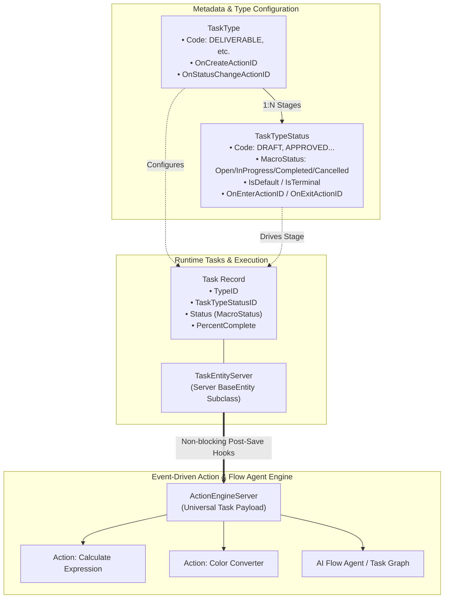
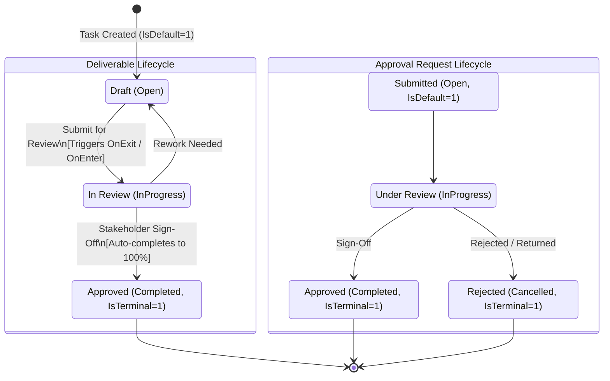
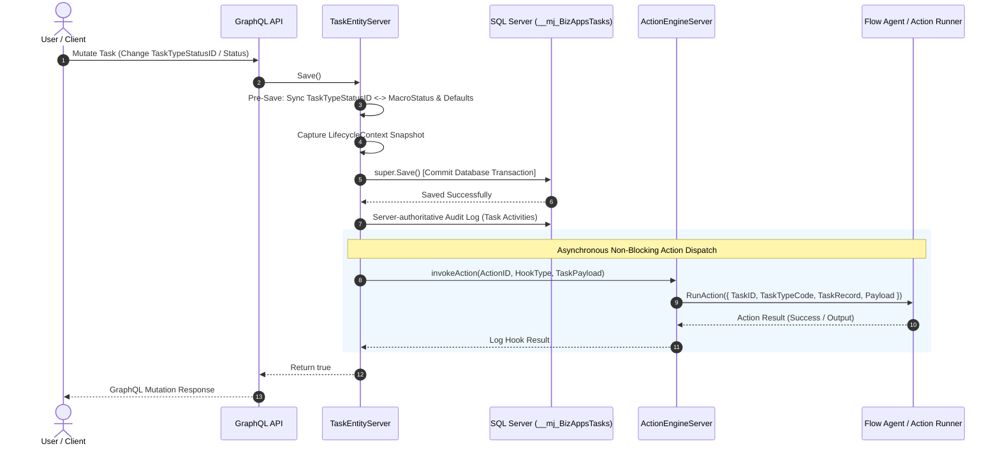
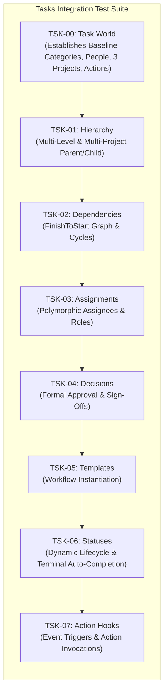

# BizApps Tasks — Task Workflow, Dynamic Statuses & Lifecycle Guide

This guide provides a comprehensive architecture reference for **Task Types**, **Dynamic Task Type Statuses (`TaskTypeStatus`)**, **Event-Driven Workflow / Action Hooks**, and **Multi-Domain Project Hierarchies** in `bizapps-tasks`.

---

## 1. Architectural Overview

BizApps Tasks provides a unified task engine across diverse business domains — from software development and legal compliance to civil construction and documentary media production.



---

## 2. TaskType Machine Codes & Cross-App Metadata

Every `TaskType` possesses a stable, unique machine code (`NVARCHAR(50) NOT NULL UNIQUE`). Downstream applications (Contracts, Accounting, Sales, ATS, Marketing, Sonar) reference these codes without relying on environment-specific UUIDs.

| Task Type Name | Stable Code | Primary Domain | Shipped Default |
| :--- | :--- | :--- | :--- |
| **General** | `GENERAL` | Universal | Standard generic task tracking |
| **Action Item** | `ACTION_ITEM` | Operations / Meeting | Action items from committee/team meetings |
| **Follow-up** | `FOLLOW_UP` | CRM / Outreach | Client and prospect check-ins |
| **Deliverable** | `DELIVERABLE` | Engineering / Creative | Work products with draft/review/approval gates |
| **Approval Request** | `APPROVAL_REQUEST` | Governance / Legal | Formal sign-off and decision gating |
| **Phase / Milestone** | `PHASE_EPIC` | Project Management | High-level roadmap and project rollups |
| **Construction Milestone** | `CONSTRUCTION_MILESTONE` | Real Estate / Civil Eng | Permitting, foundation, MEP, and inspection gates |
| **Media Production Stage** | `MEDIA_PRODUCTION` | Creative / Film | Pre-production, shooting, audio/color, release |

---

## 3. Dynamic Task Stages (`TaskTypeStatus`)

Rather than forcing every business process into a rigid 5-state status column, `TaskTypeStatus` allows each `TaskType` to define rich, domain-specific stages while maintaining standard `MacroStatus` mapping for universal Kanban, Gantt, and progress rollups.



### MacroStatus Mapping

The `MacroStatus` column (`'Open' | 'InProgress' | 'Blocked' | 'Completed' | 'Cancelled'`) ensures:
1. **Gantt & Progress Rollup**: Subtask weighted averages and completion heuristics always calculate accurately.
2. **Terminal Auto-Completion**: When entering a status where `IsTerminal = 1`, `TaskEntityServer` automatically sets `PercentComplete = 100`, populates `CompletedAt = GETUTCDATE()`, and aligns `Status`.
3. **Cross-App Queries**: Dashboards querying `Status = 'Completed'` find all completed records regardless of custom domain status names (`Approved`, `Inspection Passed`, `Released`).

---

## 4. Event Action & Flow Agent Execution Pipeline

Task lifecycle events can automatically trigger MemberJunction **Actions** (code execution, SQL, REST APIs, or AI Agents).



### Universal Task Event Payload

Every action hook receives a structured parameter set:

```typescript
{
    TaskID: string;
    RecordID: string;
    TaskName: string;
    TaskTypeCode: string;
    TaskTypeStatusID: string | null;
    TaskTypeStatusCode: string | null;
    Status: 'Open' | 'InProgress' | 'Blocked' | 'Completed' | 'Cancelled';
    PreviousStatus: string | null;
    PercentComplete: number;
    Priority: 'Low' | 'Medium' | 'High' | 'Critical';
    DueAt: Date | null;
    TaskRecord: Record<string, unknown>;
    Payload: string; // Serialized JSON payload object
}
```

---

## 5. Multi-Domain Project Hierarchies

The task engine models deeply nested, multi-tier project structures across distinct corporate departments:

```mermaid
graph TD
    subgraph P1["Project 1: Software & Platform Launch"]
        P1R["Website Redesign & Portal Launch<br/><i>(Deliverable, 40%)</i>"]
        P1R --> P1_1["GraphQL API Resolvers<br/><i>(General, 70%)</i>"]
        P1R --> P1_2["Angular Explorer Dashboard<br/><i>(Deliverable, 40%)</i>"]
        P1R --> P1_3["Security Review<br/><i>(Approval Request, 0%)</i>"]
        P1R --> P1_4["Production CI/CD Deploy<br/><i>(Action Item, 0%)</i>"]
    end

    subgraph P2["Project 2: Corporate HQ Campus Construction"]
        P2R["Corporate HQ Campus Construction & Relocation<br/><i>(Construction Milestone, 45%)</i>"]
        P2R --> P2_1["Architectural Blueprints<br/><i>(Deliverable, 100%)</i>"]
        P2R --> P2_2["Zoning Variance & Permits<br/><i>(Approval Request, 100%)</i>"]
        P2R --> P2_3["Excavation & Concrete Pour<br/><i>(Construction Milestone, 100%)</i>"]
        P2R --> P2_4["Structural Steel Erection<br/><i>(Construction Milestone, 60%)</i>"]
        P2R --> P2_5["MEP Rough-In<br/><i>(Construction Milestone, 20%)</i>"]
        P2R --> P2_6["Workplace Interior Fit-Out<br/><i>(Deliverable, 0%)</i>"]
        P2R --> P2_7["Life Safety & Occupancy Cert<br/><i>(Approval Request, 0%)</i>"]
        
        P2_1 -.->|"FinishToStart"| P2_3
        P2_2 -.->|"FinishToStart"| P2_3
        P2_3 -.->|"FinishToStart"| P2_4
        P2_4 -.->|"FinishToStart"| P2_5
    end

    subgraph P3["Project 3: 50-Year Company Heritage Documentary"]
        P3R["50-Year Company Heritage Documentary Film<br/><i>(Media Production Stage, 50%)</i>"]
        P3R --> P3_1["Archival Research & Rights<br/><i>(Deliverable, 100%)</i>"]
        P3R --> P3_2["Founder 4K Interviews<br/><i>(Media Production, 100%)</i>"]
        P3R --> P3_3["Assembly Edit & Rough Cut<br/><i>(Media Production, 75%)</i>"]
        P3R --> P3_4["Score Recording & Sound Mix<br/><i>(Deliverable, 30%)</i>"]
        P3R --> P3_5["Master 4K HDR Color Grading<br/><i>(Media Production, 0%)</i>"]
        P3R --> P3_6["Global Premiere Broadcast<br/><i>(Deliverable, 0%)</i>"]

        P3_1 -.->|"FinishToStart"| P3_3
        P3_2 -.->|"FinishToStart"| P3_3
        P3_3 -.->|"FinishToStart"| P3_5
    end
```



---

## 6. Integration Test Suite Architecture

The integration test suite (`@mj-biz-apps/tasks-integration-tests`) runs deterministically through the GraphQL and BaseEntity server runtime.


